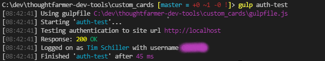

# Custom card development tools

These tools allow you to build and deploy custom cards right from your preferred IDE. We do recommend Visual Studio Code as that is where everything has been built and tested.

For details on the code involved in creating cards please see our documentation about using the [Custom card API](https://helpdesk.thoughtfarmer.com/hc/en-us/articles/1500000981081-Custom-card-API) and [Communicating between custom cards with events](https://helpdesk.thoughtfarmer.com/hc/en-us/articles/1500000981161-Communicating-between-custom-cards-with-events).

Additionally, see the [Custom Card helpers and utilities](./shared/README.md) documentation for details the FormFlow API and other concepts.


- [Custom card development tools](#custom-card-development-tools)
  - [Installation](#installation)
  - [Configuration](#configuration)
  - [Getting started](#getting-started)
  - [Sourcemaps](#sourcemaps)
  - [Linting](#linting)
  - [Build commands](#build-commands)
    - [Site parameter](#site-parameter)
    - [Card configuration](#card-configuration)
    - [`gulp config`](#gulp-config)
    - [`gulp newcard`](#gulp-newcard)
    - [`gulp manifest`](#gulp-manifest)
    - [`gulp build`](#gulp-build)
    - [`gulp sass`](#gulp-sass)
    - [`gulp compile`](#gulp-compile)
    - [`gulp create`](#gulp-create)
    - [`gulp clean`](#gulp-clean)
    - [`gulp push`](#gulp-push)
    - [`gulp upgrade`](#gulp-upgrade)
    - [`gulp eslint`](#gulp-eslint)
    - [`gulp deploy`](#gulp-deploy)
    - [`gulp dev-deploy`](#gulp-dev-deploy)

## Installation

1) Install Node version 14 or higher. https://nodejs.org/en/download/
2) Install gulp-cli globally.
   - `npm install -g gulp-cli`
3) Ensure that your npm global bin folder is added to your systems PATH environment variable. Check the path by running:
   - `npm config get prefix`
4) Install yarn package manager.
   - `npm install -g yarn`
5) Clone or download this repository to your local disk.
6) Open the folder in your preferred IDE.
7) From the integrated terminal make sure you are in the `custom_cards` folder and run `yarn install`.

## Configuration

In the root `custom_cards` folder create a new file `config.json`. Use the following as a stub for the contents:

```javascript
{
    "sites": {
        "default": {
            "baseUrl": "http://localhost",
            "restToken": "***"
        },
        "prod": {
            "baseUrl": "https://my.thoughtfarmer.com",
            "restToken": "***"
        }
    },
    "sourceMaps": true    
}
```

The `sites` property let's you manage all of the ThoughtFarmer sites you wish to deploy to. The `default` site is a special name that will be used for the main site you are working with. It will be used for all commands when no site parameter is specified. See the [site parameter](#site-parameter) section for details. Add as many sites as you need.

Update the `baseUrl` for the default site with your desired ThoughtFarmer instance URL. The `restToken` comes from the ThoughtFarmer Admin Panel --> Api Tokens admin page. You must generated one for your user. Keep the token safe as it will not be available again once generated. You can reset tokens at any time.

Once you update your `config.json` you can test it by running `gulp auth-test`. It should attempt authentication and tell you who you are logged in as.



## Getting started

To get started quickly you can use the demo card Rich Text card. Once you have configured your default site with the API Token then simply follow these instructions:

1. Open up the integrated terminal (or any shell) and navigate to the subfolder `/custom_cards/richTextCard`.
2. Run `gulp compile`. This will create both the transpiled JavaScript and CSS files in a `/dist` folder.
3. Run `gulp create`.  
   - This will automatically create a new custom card on your ThoughtFarmer instance using the details from the `manifest.json` and the compiled code.
   - It will get the id for the custom card and create or update the `config.json` for the card.
4. Follow the instructions from the [Rich text Card Readme](richTextCard/README.md) and add a configured card to any page on your ThoughtFarmer instance.
5. Make changes to the code or styles for the card.
6. Deploy the changes using `gulp dev-deploy` (for faster deploy with no linting) or `gulp deploy` to check with ES Lint first.
7. Check the ThoughtFarmer page for your changes.

## Sourcemaps

Sourcemaps are enabled by default. There is a single flag in the root `config.json` that controls this. When enabled sourcemaps will be set to pull from your local disk in the `/dist` folder for each specific card you create.

From the browser developer tools you can then find them by going to the Sources tab, then looking for files under `file://`. All the sourcemaps will be in there for each card you deploy.

You will then be able to add breakpoints and debug your code across all your original component files.


## Linting

[ES Lint](https://marketplace.visualstudio.com/items?itemName=dbaeumer.vscode-eslint) is a recommended plugin. Once you have run `yarn install` all the pre-requisites should be in place. You may also need to grant permissions to ES Lint for your workspace. To do so:

1. Go to any code file (e.g. `/custom_cards/richTextCard.tsx`)
2. Check the first line `import` statement. If there is an underline hover over it.
3. Click the lightbulb icon click it and grant permission for ES Lint either everywhere, or on the project.


When editing and writing code you should see all syntax and formatting issues highlighted. Hovering over them will give you the ES Lint reason it was flagged. Sometimes there may be multiple reasons as both JavaScript and TypeScript linting rules are in play.

Changes to ES Lint rules can be made in the `./eslintrc.js` file.

## Build commands

All the build commands rely on gulp. There are various commands to build, configure, lint, and even deploy custom cards right from the IDE to your remote ThoughtFarmer instance.

### Site parameter

Any command that interacts with a site (`push`, `upgrade`, `deploy`, `auth-test`, `dev-deploy`) all require a `-site` parameter. If none is specified it will default to the `default` site from the `config.json`.

You can have as many sites as you require. Just update the root level `config.json` to add more sites. Additionally, every custom card has a child `config.json` that will need to store the corresponding Custom Card Ids for the sites.

There is an alternative shortcut to simply call the name of the site as a flag. This will run the command against that site if it is found in the `config.json`.

Examples:

```powershell
gulp deploy  #deploys to the default site

gulp deploy -site prod #deploys to the site labelled prod

gulp deploy -prod #shortcut syntax to deploy to the site labelled prod
```

### Card configuration

Each custom card must also have a `config.json` file in its folder in order to be deployed to a remote site. For each site you wish to deploy to it must have an entry in the sites parameter along with the id.

The id comes from the ThoughtFarmer Admin Panel --> Cards page. Each custom card has an id visible in the first column from that admin page.

You can either create a new card from the admin interface, and update the `config.json` manually. Or you can use the `gulp create` command.

For example the file `./custom_cards/richTextCard/config.json` might look like this:

```javascript
{
    "sites": {
        "default": {
            "id": 21
        },
        "prod": {
            "id": 16
        }
    }
}
```

### `gulp config`

This command will create or overwrite the `config.json` file for a specific card. It is mostly used to set up an existing card that has not yet been synced with a remote ThoughtFarmer. For a new card, use the command `gulp newcard`.

Running this command will ask for a single parameter for the custom portlet id. It will update the specified site when the command was run.

```powershell
gulp config    # will update the config for the default site

gulp config -prod    # will update the config for the site labelled prod
```

### `gulp newcard`

This command must be run from the root `custom_cards` folder. It will initiate a series of prompts that will setup a new card from scratch for you.

The prompts are:

1. **Camel case name of the new card**: This will be used as the folder and entry point files for the card. Do not use dashes in the name. 
2. **Using .tsx or .jsx components? Or HTML and JavaScript?**: If you are using React components then choose either tsx (recommended) or jsx to create the corresponding entry file. Choosing html will create both an Html and JavaScript entry file. All options will create an scss entry file for styling.
3. **Custom portlet Id for the site**: This is taken from the Admin panel --> Cards page in ThoughtFarmer. If you do not have this setup yet, simply enter `0`. The first time you deploy be sure you run `gulp build` followed by `gulp create` so that a new card on ThoughtFarmer is created for you, and the custom portlet Id retrieved. Otherwise, just run `gulp deploy` to push to the custom portlet Id you set up here.

This will create the folder based on your first response, and create two entry files. The build tools depend on the entry files being the same name as the folder, so _do not_ change them. You can add as many additional files and components as you need and simply use `import` syntax to create whatever you need. A sub folder called `components` will automatically be created for you for this purpose.

### `gulp manifest`

The manifest file is required _before_ you run `gulp create`. It uses the information in this file to fill in all the meta-data required when you create a new custom card. The task will give the following prompts:

- **Name**: Name of the card as it will appear in ThoughtFarmer
- **Description** (optional): Quick summary about the card.
- **Url** (optional): Used in the Admin panel --> Cards page to direct admins to details or documentation about the card.
- **Activate the card?**: Whether the card is active and available to be added to pages or not (y/n).
- **Global card or page card?**: Global `g` or page `p` card. Specifies what type of custom card to create.
- **Is admin only?**: If admin only is `y` then only admins will see the card if added to pages. Reflects the toggle available in the Admin panel --> Cards page.
- **Has configuration options?**: Set to `y` if there is a JSON configuration that is associated with the card. `n` otherwise.
- **Can override config on template page?**: This will allow for users to edit the configuration on a per instance basis when adding the card to pages.

Once the prompts have run the script will take the responses and generate a `manifest.json` file in the folder for the custom card. As a last step you can add a `defaultConfiguration` JSON property with a template for default configuration options for your card.

As an example:

```javascript
{
    "name": "Rich text from page",
    "description": "Takes a content ID as configuration and pulls in that content into the Custom card. Security permissions will be in effect. ",
    "url": "",
    "isActive": true,
    "customCardTemplateType": 0,
    "isAdminOnly": false,
    "canOverrideConfig": true,
    "isTransformDisabled": true,
    "defaultConfiguration": {
        "sourceId": 0,
        "showTitle": false,
        "alternateTitle": null,
        "icon": null,
        "useSummary": true,
        "hideBottomBorder": false
    }
}
```

### `gulp build`

This is the main build command that will rollup and transpile all jsx, tsx, and\or JavaScript files into a single js file ready for deployment to ThoughtFarmer. The result will be in the `./dist` folder for the custom card you run it for.

You must run this command from the specific card folder you wish to target.

If `sourceMaps` is set to true in your root `./config.json` then this task will append the sourceMap references to the created `js` file, and also include the `js.map` sourcemap file.

**Tip**: This command is part of `gulp deploy` and `gulp dev-deploy` which does a number of tasks.

### `gulp sass`

This is the main command that will rollup and transpile all scss into a single CSS file ready for deployment to ThoughtFarmer. The result will be in the `./dist` folder for the custom card you run it for.

You must run this command from the specific card folder you wish to target.

**Tip**: This command is part of `gulp deploy` and `gulp dev-deploy` which does a number of tasks.

### `gulp compile`

This is a shortcut task that simply runs both the `build` and `sass` tasks at once. Useful to run the first time before running `gulp create`.

### `gulp create`

This task will take the compiled code from the `./dist` folder and create a new custom card on the designated remote ThoughtFarmer using the [site parameter](#site-parameter). This is helpful to avoid having to create a stub card via the ThoughtFarmer admin panel first. It will use the `manifest.json` file for the card during the creation process. Be sure to have a default configuration object in the `manifest.json` if required. See [gulp manifest](#gulp-manifest) for details.

### `gulp clean`

This task simply cleans out the `./dist` folder of all files. It doesn't typically need to be run on its own. However, it is part of `gulp deploy` and `gulp dev-deploy` as a first step. Files will be overwritten by other build tasks either way.

### `gulp push`

This command will push the `css` and `js` files from the `./dist` folder up to the specified site as per the [site parameter](#site-parameter). Code changes will not be live on the site. The card must be upgraded first either manually through the Admin panel --> Cards page, or via the command `gulp upgrade`.

If there is an `html` file in the root (e.g. `./custom_cards/myCard/myCard.html`) then it will also be pushed up to the remote site.

You must run this command from the specific card folder you wish to target.

**Tip**: This command is part of `gulp deploy` and `gulp dev-deploy` which does a number of tasks.

### `gulp upgrade`

To make code changes live for anything added via `gulp push` you must run this command. Once a card is upgraded all the latest code will be in effect.

You must run this command from the specific card folder you wish to target.

**Tip**: This command is part of `gulp deploy` and `gulp dev-deploy` which does a number of tasks.

### `gulp eslint`

This task runs the linter on all tsx, jsx, and JavaScript code for just your custom card. This is helpful for when there are multiple files involved and you may have missed errors highlighted in the IDE. It is recommended to always run this task as a final step to major code changes.

Linting is often the longest running process of all these tasks. So it is recommended to only run this task intermittently near the end of major code change cycles. It also checks for a flag `--no-lint`. This will bypass this task completely. Helpful when running chained tasks where you do not want this specific task to run (e.g. `gulp deploy --no-lint`).

You must run this command from the specific card folder you wish to target.

**Tip**: This command is part of `gulp deploy` which does a number of tasks.

### `gulp deploy`

This is a workflow task that performs a number of additional tasks. This task will run the following:

```javascript
'clean', 'eslint', 'build', 'sass', 'push', 'upgrade'
```

**Tip**: It is recommend to use this command as part of your workflow then the individual commands used above. The `eslint` task does take much more time than other tasks. So it is also recommended to only use this command as a last check during a major code update. Use `gulp dev-deploy` for more rapid dev, build and push worklows.

### `gulp dev-deploy`

This is a workflow task that performs a number of additional tasks. This task will run the following:

```javascript
'clean', 'build', 'sass', 'push', 'upgrade'
```

**Tip**: It is recommend to use this command for the quickest dev, build and push workflow since this skips `eslint`. Be sure to run `gulp deploy` to include linting at the end of major code updates. 
