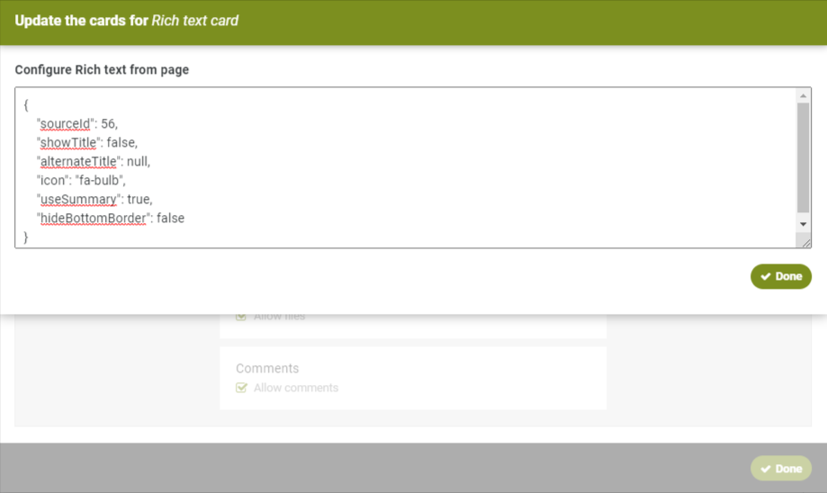

# Custom card helpers and utilities

This shared folder contains some helper and utility files and functions that will help in developing custom cards. As well, the component driven nature of React allows for developing simple reusable components that can be shared across multiple cards.

Be sure to also see the details on the [Custom Card API](https://helpdesk.thoughtfarmer.com/hc/en-us/articles/1500000981081-Custom-card-API) for adding cards to pages from code.

## Api Helpers

This describes the helpers in the file `/custom_cards/shared/apiHelpers/apiHelpers.ts`.

ThoughtFarmer uses the [Flux pattern](https://www.freecodecamp.org/news/how-to-use-flux-in-react-example/) to coordinate and dispatch messages across React components or for any asynchronous messaging. At it's simplest it performs these actions:

1. Action listeners register with the dispatcher for actions they are interested in by name (e.g. `getContentAction`).
2. Action creators fire off an action (usually asynchronous, like an API call) and register it with an application dispatcher by name (e.g. `getContentAction`).
3. When the listeners are no longer interested they unregister (e.g. when a component unmounts).
4. When the action is complete the dispatcher notifies all currently registered listeners and sends the data payload.

For details on how do to this in ThoughtFarmer Custom cards check out our page on the [Custom card event communication API](https://helpdesk.thoughtfarmer.com/hc/en-us/articles/1500000981161-communicating-between-custom-cards-with-events).

The API helpers here are wrappers around those functions that make it very easy to create JavaScript Promises and tie them to action names already registered.

Sample usage:

```typescript
export default class RTEContentContainer extends React.Component<IProps, IState> {

    // Action name is unique per instance of the custom card. 
    // The special global portletConfigurationId ensures that.
    // Otherwise multiple instances of the same card on a page may send data to each other's listeners. 
    // Only make this generic if you want communication between cards.
    private _actionName = `tfcRTEContainerPageLoaded_${portletConfigurationId}`;   
    private _apiClient: ApiClient = new ApiClient();

    constructor(props: IProps) {
        super(props);

        this.state = {
            page: null,
            hasError: false,
            errorMessage: ''
        };
    }

    componentDidMount() {
        // Register the event listener with the desired action name, and the callback when complete.
        ctx.customPortlets.addEventListener(this._actionName, this.contentLoaded);
        
        // Create the Promise. 
        const getContent = this._apiClient.content.getContent(this.props.sourceId);

        // Fire off the Promise using the apiHelper method
        firePromise(ctx, this._actionName, getContent);
    }

    componentWillUnmount() {
        // Be sure to remove the listener when it is no longer needed to avoid memory leaks.
        ctx.customPortlets.removeEventListener(this._actionName, this.contentLoaded);
    }   
    
    // This callback will be fired once the action is complete. The callback MUST have this exact signature.
    contentLoaded = (success: boolean, data: any) => {
        if (success) {
            this.setState({
                page: data
            });
        } else {
            this.setState({
                hasError: true,
                errorMessage: data
            });
        }
    }

    render() { ...
```

In addition to `firePromise` there is also `fireBatchPromises` and `getAllPagedItemsPromises`. All these functions have thorough JSDocs available with examples. So be sure to check them out as well.

## Utilities

These basic utilities help out with some common tasks related to custom cards. JSDocs for all the functions are available in `/custom_cards/shared/utilities.ts`. Be sure to check them out.

### Parsing configuration

The most useful of the utility functions is the `parseConfig` command. When users add a custom card to a page, they may optionally set a JSON configuration object for that instance of the card.

For example,



Usage in code:

```TypeScript
import { IConfigurtationItem, parseConfig } from '../shared/utilities';

const params: IConfigurtationItem[] = [
    { key: 'sourceId', type: 'int', defaultValue: 0 },
    { key: 'showTitle', type: 'boolean', defaultValue: false },
    { key: 'alternateTitle', type: 'string', defaultValue: null },
    { key: 'icon', type: 'string', defaultValue: null },
    { key: 'useSummary', type: 'boolean', defaultValue: true },
    { key: 'hideBottomBorder', type: 'bool', defaultValue: false }
];

const config = parseConfig(portletConfig, params);

// Pass all configuration parameters in as props to your component
replaceView(<MyComponent {...config}>);
```

## FormFlow API development

The FormFlow API utilizes an auto-generated TypeScript client that is available in all instances of ThoughtFarmer 10.1+. The first step in using this API client is to go to your ThoughtFarmer Administration Panel --> Theme page. Edit your current theme. In the **Custom Footer HTML** area add the following reference:

```html
<script src="/formsapi/assets/apitools/formFlowApiClient-min.js"></script>
```

This will let you use API Client globally on all pages as `tfcFormFlowApi`. To get TypeScript support this package includes a reference to the types for the client. This has been set in the `packages.json` and refers to local files in the `/custom_cards/shared/types/tfc-formflow-api` folder.

To use the API Client in your custom card code with TypeScript support just import the types and create the resource API instances you need.

See the [formWizardContainer.tsx](../formFlowWizard/components/formWizardContainer.tsx) file for details on usage.

### FormFlow UI components

The `/custom_cards/shared/formflow` folder contains some user interface components. Example usage can be found in the `formFlowWizard` custom card provided.

These components are only meant as a Proof Of Concept implementation. They do now currently support all ThoughtFarmer FormFlow field types.

Extending these POC components is easily accomplished. Or additionally, developers may choose to implement their own UI components from scratch. It is recommended that each FormFlow field have properties such as those described by IFieldProps.

```TypeScript
export interface IFieldProps {
    updateField: (fieldId: number, data: any) => void;
    field: tfcFormFlowApi.ApiFormField;
    hasError?: boolean;
    errorMessage?: string;
    defaultValue?: string;
}
```

## Scss mixins and snippets

The `./custom_cards/shared/scss` folder contains some scss mixins and snippets that may be useful. Adding your own commonly used Sass code will allow for reuse and easier change management.

A typical example might be the clearfix mixin.

```scss
@import '../shared/scss/clearfix';

.tfc-display-content {

    input {
        width: 200px;
        padding: 4px;
        float: left;
        margin-right: 10px;
        margin-bottom: 10px;
    }

    .tfc-form-label {
        font-weight: 700;
        margin-right: 10px;
    }

    .tfc-title {
        @include clearfix;
    }
}
```
